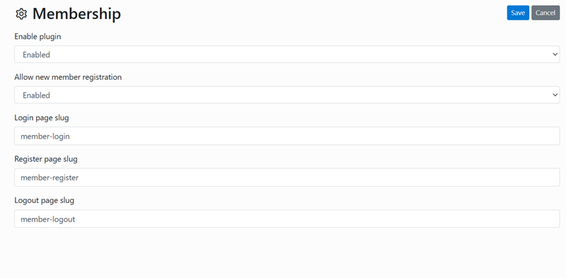

# Private Mode NG
Plugin for Bludit CMS - Inspired by '[Private Mode](https://plugins.bludit.com/plugin/private-mode)' 

 

## Features

- Enable/disable private mode
- Setting a text for the modal message pop-up window
- Url for redirection (admin area or page with call-to-action button)
- Private mode for the complete website (on/off)
- Private mode for the selected category (if the mode for the website is set to 'off')
- Linking in sidebar on/off (with status display)

 

## Supported Languages

- English
- German

 

## Requirement

- installed Bludit 3.x

 

## Install

- Download the **Private Mode NG** Plugin
- Upload the main plugin folder to your `bl-plugins` directory of your Bludit Website(s)
- Enable the **Private Mode NG** Plugin on the Plugins admin page

 

## Screenshot

- Bludit Backend (Dark Theme; German)

 

## Copyright & License

**Private Mode NG** is open source software licensed under the [MIT license](https://opensource.org/licenses/MIT).

 
